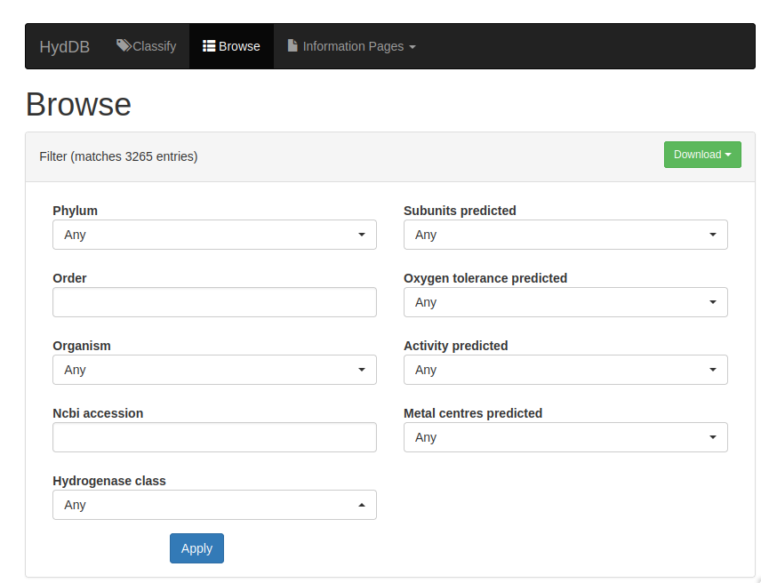

# HydDB



The hydrogenase database (HydDB) provides information pages for different groups of hydrogenases, and a sequence classifier tool for predicting the putative functions of input hydrogenase sequences.

The HydDB is described in Søndergaard1, Pedersen, & Chris Greening (2016) *Scientific Reports* (<https://doi.org/10.1038/srep34212>)

## Installing and hosting the HydDB locally

You can use Docker to host the website locally on your own machine.
We recommend this if you expect to be running a large number of sequences through the classifier tool.

**Requirements**: make sure you have Docker installed and is running (this may require running `systemctl start docker`).

### Option 1: Pull the Docker image

The first option is to pull the image from Docker Hub:

```bash
docker image pull jameslingford/hyddb-website:latest
```

### Option 2: Build and compose the Docker image from scratch

Alternatively, you can build the [Docker](https://www.docker.com) image from scratch by cloning this git repository and running Docker build:

```bash
git clone https://github.com/jlingford/hyddb_web
cd hyddb_web
docker build -t jameslingford/hyddb-website .
```

### Running the website locally

Docker Compose is used to get the website up and running. This requires downloading the `docker-compose.yml` file from this repository.
Either download this file separately, or clone the whole repo:

```bash
git clone https://github.com/jlingford/hyddb_web
cd hyddb_web
```

To run the web service, you may want to first modify the environment variables in
`docker-compose.yml` to fit your development environment (such as the locations of the volume directories).

Run the following commands in order, being sure to run `docker compose up -d` in the same directory as the `docker-compose.yml` file:

```bash
docker compose up -d
docker compose run web python manage.py migrate
docker compose run web python manage.py loaddata hydrogenaseclass hydrogenasesequence
docker compose run web python manage.py train
docker compose run web python manage.py trainupstream data
```

Or alternatively, run all of these commands from the script `run_docker_compose.sh`:

```bash
./run_docker_compose.sh
```

### Viewing the website locally

The website should now be accessible locally at `http://0.0.0.0:8000/` or `http://127.0.0.1:8000/`.
Open the address in your internet browser (Firefox works the best in my opinion).
Happy hydrogenase hunting!

## Limitations and areas for improvement

### Limitations of the sequence classifier

HydDB is unable to accurately check whether uploaded sequences correspond to hydrogenases or not. Instead, it is well-suited for functionally-predictive classification of known hydrogenases into different subgroups. Please ensure that all sequences that you upload correspond to catalytic subunits of hydrogenases (e.g. using conserved domain database and phylogenetic trees). Sequences that do not encode catalytic subunits of hydrogenases will still be classified, but the result may be wrong.

### Missing protein databank (PDB) information

Since migrating the HydDB from its original server, the information tables for protein structures were lost.
These included PDB codes for different hydrogenases, including details of protein structure resolution and host species.
Therefore, all "Structures" tables (under the "Architecture" section of each "Information Page" entry) says "None".
Since it would be quite laborious to add this PDB info back in, a quick workaround to find a list of PDBs for each hydrogenase will be to search the [UniProt](https://www.uniprot.org/id-mapping) database with the NCBI RefSeq accession ID's provided in the HydDB.
UniProt entries contain up-to-date PDB's and AlphaFold2 models.

### Updating the HydDB

The HydDB was released in 2016, so it is quite old at this point.
We are actively working on a HydDB v2.0 to provide greater coverage of hydrogenase phylogenetic diversity and develop a better classifier tool.
In the meantime, we are providing the original code for the HydDB v1.0.
The code has not been actively maintained and still runs on Python 3.5.
This will likely result in issues when trying to build the Docker image from scratch at some point in the future as more of the conda environment dependencies become outdated.
If there are any issues, please open a new issue on this GitHub page.

## Citation

If you use the HydDB in your research, please cite the following:

```
@article{S_ndergaard_2016, title={HydDB: A web tool for hydrogenase classification and analysis}, volume={6}, ISSN={2045-2322}, url={http://dx.doi.org/10.1038/srep34212}, DOI={10.1038/srep34212}, number={1}, journal={Scientific Reports}, publisher={Springer Science and Business Media LLC}, author={Søndergaard, Dan and Pedersen, Christian N. S. and Greening, Chris}, year={2016}, month=sep }
```
